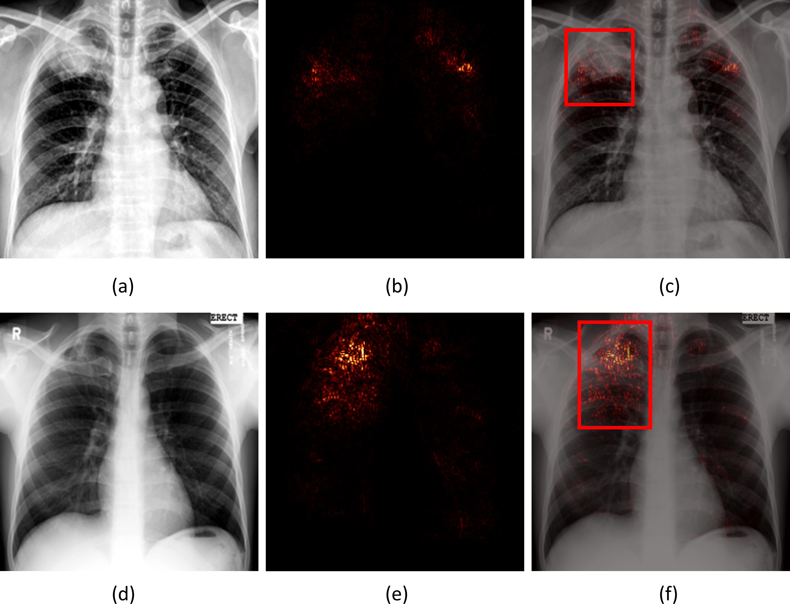

# UNets-for-TB-segmentation-and-localization

Deep learning (DL) has drawn tremendous attention in object localization and recognition for both natural and medical images. U-Net segmentation models have demonstrated superior performance compared to conventional hand-crafted feature-based methods. Medical image modality-specific DL models are better at transferring domain knowledge to a relevant target task than those that are pretrained on stock photography images. Using those helps improve model adaptation, generalization, and class-specific region of interest (ROI) localization. In this study, we train custom chest X-ray (CXR) modality-specific U-Net models for semantic segmentation of Tuberculosis (TB)-consistent findings. Automated segmentation of such manifestations could help radiologists reduce errors following initial interpretation and before finalizing the report. This could improve radiologist’s accuracy by supplementing decision-making while improving patient care and productivity. Our approach uses a comprehensive strategy that first uses publicly available TBX11K CXR dataset with weak TB annotations, typically provided as bounding boxes, to train a set of U-Net models. Next, we improve the results of the best performing model using an augmented training strategy on data with weak localizations from the outputs of a selection of DL classifiers that are trained to produce a binary decision ROI mask for suspected TB manifestations. The augmentation aims to improve performance with test data derived from the same training distribution and other cross-institutional collections including Shenzhen and Montgomery TB CXR datasets. We observe that compared to non-augmented training our augmented training strategy helped the custom CXR modality-specific U-Net models achieve superior performance with test data derived from the same training distribution as well as from cross-institutional collections. 

We believe that this is the first study to i) use custom CXR modality-specific U-Net models to segment TB-consistent manifestations using CXRs, and ii) evaluate the segmentation performance while augmenting the training data with weak TB-consistent ROI localizations using test data derived from the same training data distribution and other cross-institutional collections to evaluate model robustness and generalization to real-time applications. The use of CXR modality-specific U-Net models and augmented training using weak TB-consistent ROI localization is expected to improve segmentation performance. The proposed approach could be applied to an extensive range of medical segmentation tasks. 

In this retrospective study, we propose a stage-wise methodology. First, we retrain the ImageNet-pretrained DL models on a large-scale collection of CXR images to convert the weight layers specific to the CXR modality and help learn CXR modality-specific feature representations. Second, we propose CXR modality-specific VGG-16 and VGG-19 U-Net models to improve performance in the lung segmentation task. Next, we perform a knowledge transfer from CXR modality-specific pretrained DL models and fine-tune them to classify CXRs as showing normal lungs or pulmonary TB manifestations. The best performing model is used to weakly localize the TB-specific ROI using saliency maps and class-selective relevance mapping (CRM) methods using the patient-specific test data. The localized ROI is then converted into bounding box masks. Further, the proposed CXR modality-specific and other SOTA U-Net model variants used in this study are trained and evaluated to segment TB-consistent manifestations using CXRs. We performed cross-institutional testing with the publicly available Shenzhen TB CXR and Montgomery TB CXR collections to evaluate model robustness and generalization. Finally, we augment the training data with the weak TB-consistent ROI masks from the outputs of the best performing fine-tuned model and their associated original CXRs to improve TB segmentation performance. We evaluate the segmentation performance using both training-distribution similar as well as observe the models’ generalization capability using Shenzhen TB CXR and Montgomery TB CXR cross-institutional test collections while augmenting the training data with weak TB-consistent localizations. Fig 1 illustrates the aforementioned steps toward the current study. 

The datasets used in various stages of the proposed study and their distribution are shown below.

We trained the segmentation models to generate lung masks at 256 × 256 spatial resolution for the various CXR datasets used in this study. The generated lung masks are overlaid on the original CXR images to demarcate the lung boundaries and then cropped into a bounding box encompassing the lung pixels. 

We used the STAPLE algorithm to build a consensus ROI annotation from the experts’ annotations for the Shenzhen TB CXR and Montgomery TB CXR data collections. 

We studied the saliency maps to interpret the learned behavior of the VGG-16 fine-tuned model that delivered superior performance in classifying CXRs as showing normal lungs or pulmonary TB manifestations. Saliency visualizations generate heat-maps by measuring the derivative of the output class score concerning the original input. The resolution of saliency maps is higher compared to CAM-based visualizations. Figure below shows saliency map visualizations achieved with the VGG-16 fine-tuned model using an instance of abnormal CXR each from the Shenzhen TB CXR-Subset-1 and Montgomery TB CXR test set to visualize regions of TB manifestations. 

The repository includes a Jupyter notebook file that contains the code for the entire project with detailed discussions about the various levels of thhis stagewise, systematic study. The manuscript is currently under preparation. 
